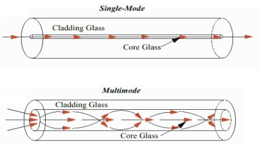

# Physical Layer 🔢

#physical #layer #ISO #ISO/OSI #TCP #TCP/IP #VLAN #VTP #vampire_tap #PoE #ethernet #_802_1X #_802_11 #_802_

**Ethernet** Detiene una posizione dominante nel mercato delle LAN cablate; è stata la prima LAN ad alta velocità dopo la DSL nella metà degli anni '70. La **topologia** della rete era a bus e adesso abbiamo lo switch con configurazione a stella=>
 
 

 
> [!IMPORTANT]
> 
> ***Physical layer***
>
> La NIC incapsula i datagrammi IP in un **pacchetto ethernet** di questo tipo =>
> 
> 

>
> - **Preambolo** -> Serve ad allineare i pacchetti ethernet sul mezzo trasmissivo, quindi per sincronizzarli
> - **Dati** -> L'unità massima di trasferimento è **MTU** da 46 byte fino a 1500 byte. Se il datagramma è + grande di questa unità viene frammentato altrimenti se è più piccolo di 46 byte viene riempito di 0
> 	-  **Indirizzo di destinazione** -> Il MAC di destinazione da 6 byte oppure di broadcast. Questo indirizzo è dell'**interfaccia che deve ricevere il frame**
> - **Indirizzo sorgente**
> - **Type** -> Supporto di protocolli
> - **Controllo CRC** -> Controllo errori bit
> 
> Il preambolo e il CRC sono gestiti a livello della scheda di rete quindi non vengono visualizzati dal programmatore
> 
> 

> 
> Tra un frame ethernet e un altro bisogna aspettare questo <mark>l'**Interpacket Gap** ( #IPG )</mark> ovvero il **tempo minimo di attesa tra due frame Ethernet consecutivi** per permettere ai dispositivi di rete di elaborare il pacchetto ricevuto prima di trasmetterne un altro
>
> - **Valore tipico**: **96 bit-time** ( *che equivale a 12 byte di "vuoto" sulla linea* )
> - Questo intervallo è **obbligatorio** per garantire che il sistema possa sincronizzarsi e prevenire la congestione nei dispositivi di rete
> - Viene inserito **dal trasmettitore**, non fa parte del frame Ethernet e non viene trasmesso come dato reale
> 
> 

> 
> Questo livello è **connectionless e non affidabile** poiché che non abbiamo ACK e i pacchetti danneggiati che si perdono o non arrivano a destinazione vengono eliminati. Per rilevare le collisioni si usa **CSMA/CD** con **binary backoff**. Un protocollo per aggiungere sicurezza a questo livello è l' **==802.1X==**
> 
> 

> 
> Con il tempo la velocità della connessione è cambiata aumentando sempre di + =>
> 
> 

> 

>
> *Ho tanti pacchetti che viaggiano nel canale* 
> 

> [!NOTE]
> 
> ***802.1X***
> 
> 

> 

> 

>  
> IEEE **802.1X** è uno **standard di autenticazione per reti cablate e Wi-Fi** che garantisce che solo i dispositivi autorizzati possano connettersi alla rete Ethernet o Wi-Fi
> 
> - Viene utilizzato per il **port-based network access control ( #PNAC )**, cioè per controllare **chi può accedere alla rete** già a livello di switch o access point
> 
> 802.1X si basa su **tre attori principali** =>
> 
>  1. **Supplicant** ( *Dispositivo dell’utente* ) → Il client che vuole connettersi alla rete
>  2. **Authenticator**  ( *Switch o Access Point* ) → Il dispositivo di rete che fa da intermediario
>  3. **Authentication Server** ( *Tipicamente un server #RADIUS* ) → Decide se il dispositivo è autorizzato
>
> <mark>**Processo di autenticazione**</mark>
>
> 1️⃣ **Il dispositivo si collega alla rete**, ma lo switch/AP blocca il traffico tranne quello di autenticazione
>
> 2️⃣ **Lo switch invia una richiesta #EAP ( Extensible Authentication Protocol )** al dispositivo per chiedere le credenziali
>
> 3️⃣ **Il dispositivo risponde con username e password (o certificato)**
> 
> 4️⃣ **Lo switch inoltra la richiesta al server RADIUS**, che verifica le credenziali
> 
> 5️⃣ **Se l’autenticazione è corretta**, lo switch sblocca la connessione e permette l’accesso alla rete
>

> [!TIP]
> 
> ***Connection Cable***
> 
> Anche chiamato **medium**, non sono altro che il canale tramite il quale il messaggio passa dalla sorgente alla destinazione. Distinguiamo =>
> 
> - **Cavi in rame** -> Utilizza segnali elettrici per trasmettere dati tra i dispositivi. Il **cavo coassiale** è generalmente di rame o alluminio ed è utilizzato per tv o sistemi di comunicazione satellitari. Sostituiti poi dai **cavi UTP**. Ne esistono di 3 tipi =>
> 	- **10BASE5** -> 10Mb/s
> 	- **RG-59** -> Tv americane
> 	- **RG-6** -> Superiore a tutti
> 
> 

> 
> Poi abbiamo il cavo twisted che è usato per la maggior parte delle reti. Sono 4 coppie intrecciate per proteggere il segnale da errori di diafonia ( *errore generato da una coppia di cavi adiacenti* ). Questo cavo però non è protetto da interferenze elettromagnetiche o radiofrequenze
>
> 

> 
> - **Cavi in Fibra Ottica** -> Utilizza fibra di vetro o di plastica per trasmettere dati sotto forma di impulsi luminosi. Distinguiamo **fibra single mode** e **fibra multi mode**. La prima è + costosa ma usa tecnologia laser per inviare raggi di luce in un core + piccolo. Il secondo ha un core + grande e utilizza emettitori LED per gli impulsi luminosi
> 
> 

> 

> 

>
> - **Connessioni Wireless** -> Si utilizzano onde radio, raggi infrarossi o trasmissioni satellitari 
> 
> 

> 

> [!TIP]
> 
> ***Ethernet***
> 
> 

> 
> Inizialmente ethernet era un progetto creato in questo modo -> 
> 
> *Un cavo coassiale ( giallo ) collegava i vari nodi e alle estremità vi erano 2 tappi che permettevano al segnale che si propagava nel filo di non rimbalzare, quindi portandolo a massa. I computer si attaccavano fisicamente al filo tramite **vampire tap** ovvero si bucava il cavo e si attaccava un altro filo. Il transceiver era invece un adattatore che trasformava il segnale elettrico in bit che poi andavano nell'interfaccia di rete, gestita poi da un controller*
> 
> **Problemi** => 
> 1. Frequenti problemi di **collisioni** e scomodità per portare il filo
> 2. Una persona che si collegava al filo poteva sentire tutte le conversazioni
> 
> 

> 
> Questa tipologia a bus, ulteriormente migliorata nel 1988, si è trasformata nella **tipologia a stella** nel 1990. Questa tipologia operava originariamente in **half duplex** quindi aveva gli stessi problemi delle altre tipologie, ovvero che tutti spedivano a tutti e gli altri computer non potevano rispondere fin quando il canale non era libero. Successivamente è nata la tipologia **full duplex**
> 
> 

> 
> In questo modo si può **ricevere e trasmettere contemporaneamente**
> 
> 

> 
> Per unire alimentazione e flusso di dati è nato il protocollo <mark>***Power over Ethernet PoE***</mark>
>
> 

> 
> La **40 Gb Ethernet** è implementata unendo 4 lane, ognuna con capacità di 10Gb/s. Queste implementazioni dello standard moltiplicato per 4 sono dei modi per non aspettare troppo per l'uscita del prossimo standard
> 
> 

> 
> Notiamo che la velocità del flusso dei dati cresce molto + velocemente rispetto alla velocità del processore che ha per catturare ed elaborare i pacchetti 
> 

> [!TIP]
> 
> ***Connection Device***
>
> - **Patch Panel** -> Punto di raccolta dei cavi
> - **Repeater** => Opera solo a livello fisico, rigenera il segnale che riceve
> - **Hub** => Reapeater multi porta
> 
> 

> 
> - ***Switch*** => Operano sia a livello fisico rigenerando il segnale che a livello link verificando gli indirizzi MAC. Lo switch distrugge e rigenera il pacchetto dato che controlla il CRC e genera il preambolo. Una sua proprietà è chiamata di **==Store and Forward==**. Questi dispositivi hanno una tabella che usano per filtrare i frame in maniera selettiva
> 
> 

> 

> 
> Gli host non si rendono conto della presenza degli switch e non devono essere configurati ma vale la regola **plug & play, self learning** ( *sono invisibili* )
> 
> Gli switch **bufferizzano i pacchetti** per gestire temporaneamente le trasmissioni in attesa di inoltro
> 
> 

> 
> Questa tabella viene costruita in maniera dinamica quando gli host comunicano tra di loro. *E se collego più switch tra di loro?*
> 
> 

> 
> In una rete del genere, ad una porta switch corrisponderanno + indirizzi MAC poiché avrò più host raggiungibili nella stessa sottorete da una singola porta
> 
> **Ad una porta posso associare anche + indirizzi MAC di un' unico computer**  ( *macchine virtuali installate* )
> 
> Per configurare un dispositivo di livello 2, che quindi normalmente non ha un indirizzo IP, si utilizza una porta **seriale**. Oggi gli switch hanno, oltre la parte di livello 2 che comprende le porte ethernet, un control panel con un proprio indirizzo IP che serve a configurare lo switch tramite browser
> 
> Le porte di uno switch possono essere anche logiche, accomunate da un unico MAC. Questo perché le interfacce logiche, i MAC virtuali etc ... esistono per semplificare le comunicazioni. Un esempio è l'interfaccia logica di <mark>**loopback**</mark>
> 
> - ***Router*** => Opera sia a livello fisico rigenerando il segnale che a livello link verificando il MAC che a livello network verificando l'indirizzo IP. I router però hanno un proprio indirizzo MAC e un indirizzo IP. Operano a livello link e fisico solo per l'interfaccia in cui arriva il frame e poi cambiano l'indirizzo MAC dei frame che inoltrano 
> 

> [!TIP]
>
> ***VLAN Virtual Local Area Network*** 
> 
> 

> 
> In questa rete se un utente invia un messaggio in broadcast viene inviato a tutti. Per evitare che un host possa fare ciò sono state introdotte le VLAN. L'idea è quella di creare **+ LAN logiche** chiamato <mark>**broadcast domain**</mark> ovvero l'insieme di + host in cui arrivano i messaggi di broadcast
> 
> Tutto questo senza separare i dispositivi e gli switch ma configurando uno stesso dispositivo per renderlo **+ dispositivi logici**
> 
> 

> 

> 
> I dispositivi della stessa VLAN quindi, comunicano e leggono i messaggi in broadcast della propria VLAN. Se un dispositivo vuole comunicare con un altra VLAN non possiamo più usare gli switch ma dobbiamo salire di livello usando i Router. *In che modo?*
> 
> Lo switch determina se il frame MAC in arrivo fa parte della stessa VLAN, in caso contrario inoltra il pacchetto al router 
> 
> 

> 
> Possiamo realizzare le VLAN con questo metodo chiamato **port-based VLAN** oppure in base all'indirizzo **MAC VLAN** ovvero il gestore della rete specifica un insieme di indirizzi MAC; quando un dispositivo viene collegato ad una porta questo viene associato alla VLAN in base al MAC, oppure un altro modo per definire le VLAN è tramite il **network layer VLAN**. Il primo metodo è anche dinamico perché siamo in grado di modificare altre porte 
> 
> 

> 

> 
> Per unire più switch per renderli come un unico dispositivo di livello 2 si può utilizzare una ***trunk port*** =>
> 
> 

> 
> Le VLAN vengono gestite dallo switch, e per permettere la separazione del traffico tra VLAN diverse, viene utilizzato un **tag VLAN** ( *IEEE 802.1Q* ). Questo **tag viene aggiunto ai frame Ethernet** quando attraversano una porta **trunk**, ovvero una porta che trasporta traffico di più VLAN
> 
> Quando il pacchetto arriva alla **porta di destinazione ( access port )**, che collega un host o esce verso Internet, **il tag VLAN viene rimosso**
> 
> Se due host di VLAN diverse devono comunicare tra loro, la comunicazione avviene tramite un **router** o un **layer 3 switch**, che instrada i pacchetti da una VLAN all'altra ( **inter-VLAN routing** )
>
> 

> 

> 
> ll **VTP** ( **V**irtual **T**runking **P**rotocol ) è un protocollo di livello 2 realizzato da Cisco, il cui scopo è quello di mantenere allineato il database in cui sono contenute le VLAN comuni a più switch. Affinché la propagazione delle informazioni avvenga correttamente, è necessario che tutti gli switch facciano parte dello stesso dominio VTP
> 
> Uno switch può operare in ***tre modalità*** VTP →
>
> 1. **Server** → Crea, modifica e cancella le VLAN per l’intero dominio VTP e salva le informazioni relative alle LAN virtuali all’interno dell’NVRAM. E’ la modalità di default per gli switch su cui viene abilitato il VTP 
> 2. **Client** → Non può effettuare operazioni dirette sulle VLAN di dominio e non salva nell’NVRAM le informazioni inviate dal server, occupandosi esclusivamente di propagarle ai vicini
> 3. **Transparent** -> Può eseguire il forwarding delle informazioni inviate dal server ma è caratterizzato dalla presenza di un database locale di VLAN, il quale non influenza il database di dominio
>

> [!NOTE]
> 
> ***Complete Sample***
>
> **Scenario** =>
> 

>  
> Partiamo dicendo che un host si collega ad una rete scolastica e quindi avrà bisogno di un indirizzo IP assegnato dinamicamente tramite **protocollo DHCP** =>
> 

>  
> Il pacchetto **DHCP è incapsulato in UDP incapsulato in IP incapsulato in 802.3 Ethernet**. Questo frame ethernet viaggerà in broadcast ( FFFF.FFFF.FFFF.FFFF ) e arriverà al router che ospita il servizio DHCP che deincapsulerà il pacchetto. Adesso inizia il protocollo DHCP e intanto lo switch avrà memorizzato l'indirizzo MAC del Server DHCP ( router ) 
> 
> 

> 
> Adesso che sappiamo anche l'indirizzo del server DNS ( dato dal DHCP ) inviamo la query per scoprire dove si trova il sito www.google.com, prima inviamo una ARP query per capire dove si trova il server DNS, successivamente inviamo la query che ci restituirà l'indirizzo a cui richiedere la pagina
>
> 

> 

> 
> Adesso per mandare la richiesta HTTP bisogna connettersi tramite TCP creando un socket e infine inviare una richiesta HTTP 
> 

---